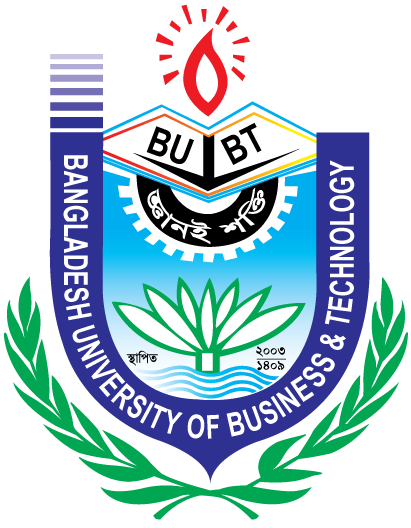
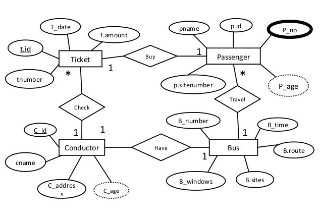
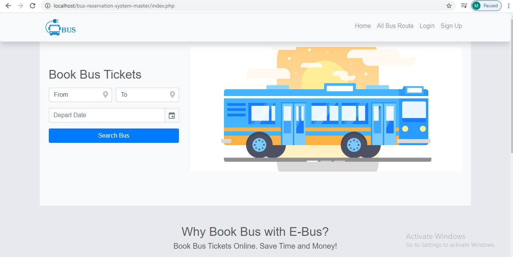
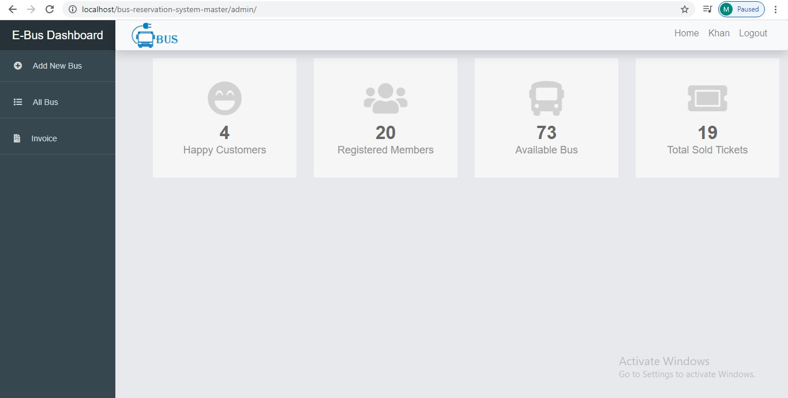
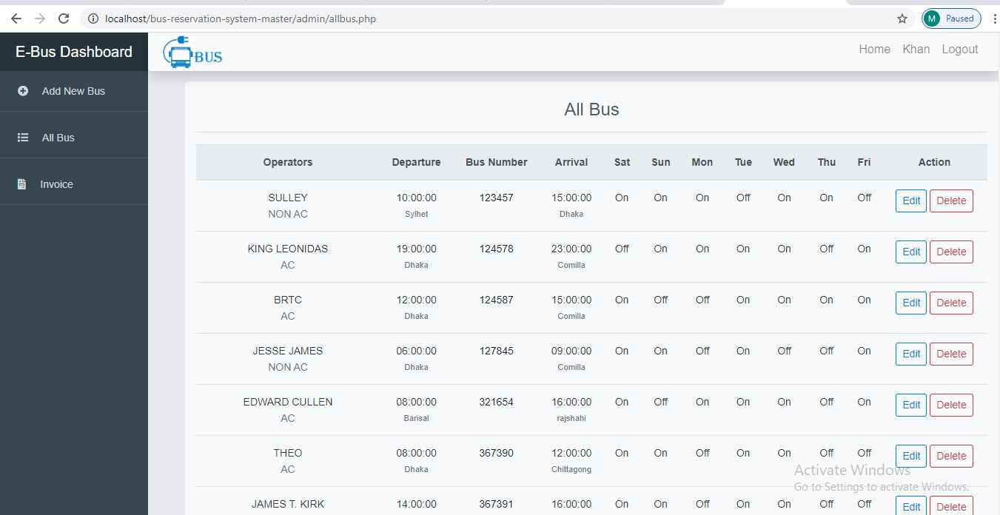
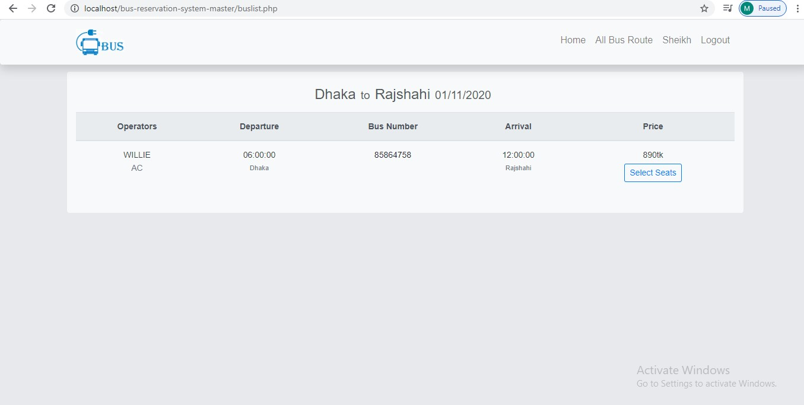
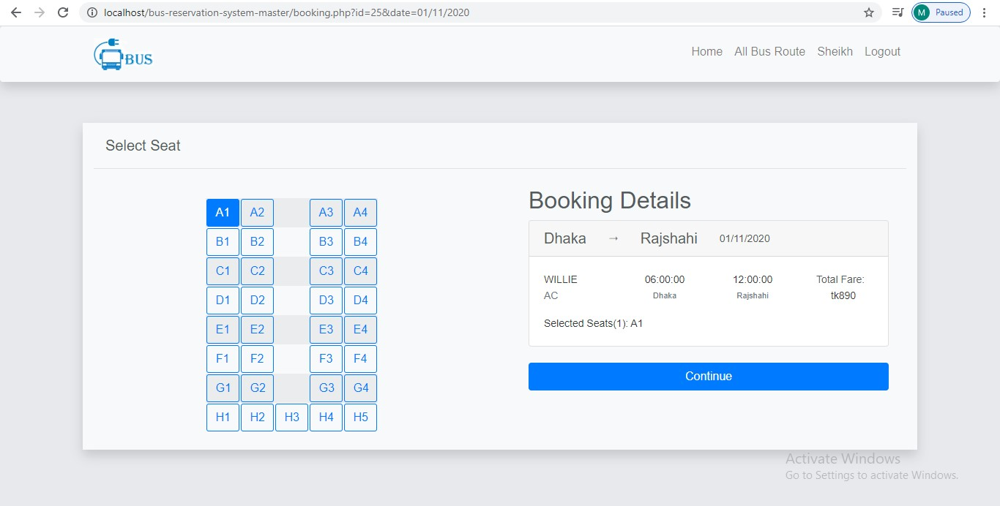
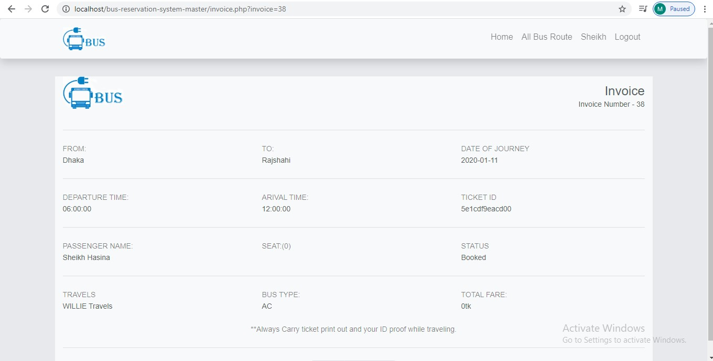

Bangladesh University of Business and technology (BUBT)

(Department of Computer Science and Engineering)

# Online Bus Reservation

##Supervisor

Sadah Anjum Shanto

Lecturer

Dept. of CSE

##Supervised

Safiul Islam 

ID:17182103210

Intake: 38

Section: 05

###Abstract
This is a web-based e-commerce project which was developed for Online
Bus ticket Reservation. In this world of growing technologies everything
has been e-commerce web-based computerized. In this situation we are
developed e-commerce web-based Bangladeshi peoples (Online Bus
Reservation). We understand the scope of this project is to design and
develop a professional e-commerce website for interested in keeping the
bus. In this site anyone see the Bangladeshi buses and buy tickets on
online.

**Approval**

This Project Report is Submitted by Shafiul Islam, Id
No.17182103210; in partial fulllment of Web Database Programming Lab
Project Submission for BSc. Engg. in CSE degree has been examined and
accepted for further process.

Approved

Ms. Sadah Anjum Shanto

Lecturer

Department of CSE, BUBT.

Date:

**Decleration**

We hereby declare that the project entitled Online Bus Reservation
System submitted in partial fulllment of the requirements for the course
Database Management System for degree of Bachelor of Science in Computer
Science and Engineering in the Faculty of Computer Science and
Engineering of Bangladesh University of Business and Technology (BUBT)
is our own work and that it contains no material which has been accepted
for the award to the candidate(s) of any other degree or diploma, except
where due reference is made in the text of the project.

Shafiul Islam

Id No.17182103210

**Dedication**

I dedicate this project to God Almighty my creator, my strong pillar,
our source of inspiration, wisdom, knowledge and understanding. He has
been the source of my strength throughout this program and on His wings
only have. I also dedicate this work to my teammates. Specially Safiul
who has encouraged me all the way and whose encouragement has made sure
that I give it all it takes to finish that which I have started.

Thank you. My love for you all can never be quantified. God bless you.

**Acknowledgement**

Praise to Allah, the most magnicent and the most merciful, without whose
patronage and blessing this project would not have been successfully
completed. He gave us zeal, condence, power of determination and courage
and vanquished all the stumbling hardness that we faced on the way. It
is an auspicious occasion for us as students of Department of Computer
Science and Engineering, one of the prestigious academic centers of the
Bangladesh University of Business and Technology (BUBT), to express our
deep feelings of gratitude to the department . We are immensely indebted
to our supervisor, Ms.Sadah Anjum Shanto, Lecturer, Department of
Computer Science and Technology, for his wonderful guidance,
inspiration, encouragement and also for through review and correction of
this dissertation work that could not be nalized with-out her astute
supervision. We would also thank to our honorable Chairman of Department
of CSE for his support and giving us permission to use the computer labs
whenever we needed. We wish we could fulll their aspiration. We also pay
regards to our friends in the department who, through their interest and
work, are our contestant source of inspiration.

Introduction 
============

Objectives 
----------

The main objective of the proposed system (Bus Reservation System)
is to eliminate the manual reservation system. Making the reservation
system, fast, user friendly avoid the unnecessary delay in reservation.
The new system needs to develop that can handle lots of records and
reports efficiently.

The Bus ticket reservation system is currently maintaining the project
Transport Company's process manually which is a very time consuming
process. It deals with transport industry's ticket booking and transport
maintenance, so it becomes a very tedious job for the ticket booking
transporter to look after these particulars to complete the task at
right time. The bus ticket booking system not only deals with
transporters owned vehicles but also takes into consideration about the
other types project of system transport vehicles available with other
transporters .

Features 
--------

Using a booking system for your property serves two main goals; 1) you
get to manage your bookings easily in one system, 2) your guests get an
optimal booking experience because of your easy-to-use booking form.
These goals already hint how your booking system should function and
what your booking form should look like, whether you run a surf camp or
a yoga retreat venue. You want it to be simple to use yet
state-of-the-art - so guests are inticed to book instantly.

Literature Review 
=================

Project Overview 
----------------

The online product information is designed for start-ups and also for
the small business owners who want to take themselves to the higher
ranks. The server is efficient so they do not need a lot of money to
maintain it. Again due to the user friendly interface, it is easy to use
for the beginners.

Methodology 
===========

Methodology is the symmetric and theoretical analysis of the applied
method to a study field. It encompasses concepts such as premises,
theoretical models, phases and qualitative or quantitative techniques.

ER Diagram 
----------

An Entity Relationship Diagram is a type of flowchart that shows how
entities relate to each other within a system. The diagram is most often
used to design or debug relational databases of a system. An ER diagram
is created by using various symbols mentioning different sectors.

ER diagrams are related to Data Structure Diagrams(DSD), which focus on
the relationships of elements within entities rather than the entities
themselves. The ER diagram for constructing **Bus Reservation System**
is shown in the following figure.

Development 
===========

The first stage of development phase is to construct problem solving
codes with proper documentation. Some may work while some may not. But
continuing tests again and again to help to make a solution. The
developing phase requires creativity of the developers. The structured
figure is also created during this phase. The whole team works together
to get rid of any sort of accidents.

Starting the development cycle 
------------------------------

This phase introduces and discusses about code components, apply methods
and also modifying the things to meet the needs of client.

Building a concept 
------------------

A proof-of-concept is a presentation of a product, which proves its
feasibility. Companies and startups use this concept to demonstrate that
their idea could, in reality, be built and achieve certain goals. This
presentation goes to their managers, shareholders or potential
investors.

Developing the solution components 
----------------------------------

The team needs to determine what tools and technologies will be used to
produce the needed information products. They develops and conducts unit
functional tests to make sure that all the features are working
perfectly. A daily build exposes unwanted faults. The team runs
everything on daily basis to ensure the accurate structure.

Testing Scenario 
----------------

The team use the solution the fix the problems. The solution is tested
again and again. If it misses any point of problem, the developers start
to fix things again. Thus a solution make it's way to perfection.

Solution build-up 
-----------------

A series of very frequent test creates a perfect solution with major
internal builds. These builds are subjected to some or the whole part of
project test suite as a way of tracking overall progress of the
solution.

Screenshots of admin panel
--------------------------

### Login

This is the logging in page for admin or user.

### Admin Login

When admin logged in with his/her account the following page will open
for admin. Where admin can check Happy Customers, Registered Members,
Available Bus and Total Sold Tickets.

### All buses route 

This is the all buses route for admin. Where admin can check all buses,
remove or add new buses, also can edit on buses.

### Invoice

This is the invoice page. Here admin can see the details about a user
ride.Admin can check the invoice number, the name of the user, bus name,
bus number, which seat a user selected, starting to ending point,
journey date, ticket number.

Screenshots of user panel
-------------------------

### Available bus for travel 

When a user given the destination with arrival date, then available bus
will show for selecting seat.

### Selection seat 

From here a user can choose one or multiple and suitable seat for user.

### Ticket 

This is the invoice for a user which the user will print as his or her
bearing ticket.

Conclusion
==========

Nowadays, bus agencies are taking important role in transportation, and
to make reservation reliable they need a strong system that they will
make reservation easier, faster and safer. This project designed to meet
requirements of a bus reservation system. It has been developed in
XHTML, PHP, CSS, JAVASCRIPT and database has been built in MySQL. By
using this application, the company can provide reservation services and
information to their customers without the limitation of office hours or
manpower. Not only does it let customers book trips around the clock
from any location with an internet connection but it is also designed
for use by the company to internally manage their business processes;
minimizing human errors and overcoming difficulties and problems that
arose in the previous system.
